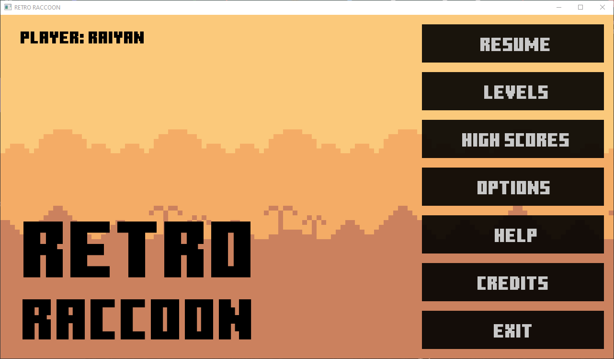
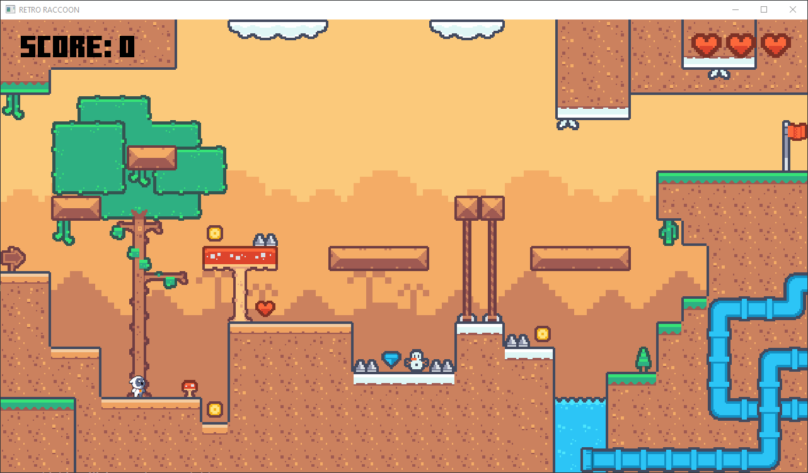
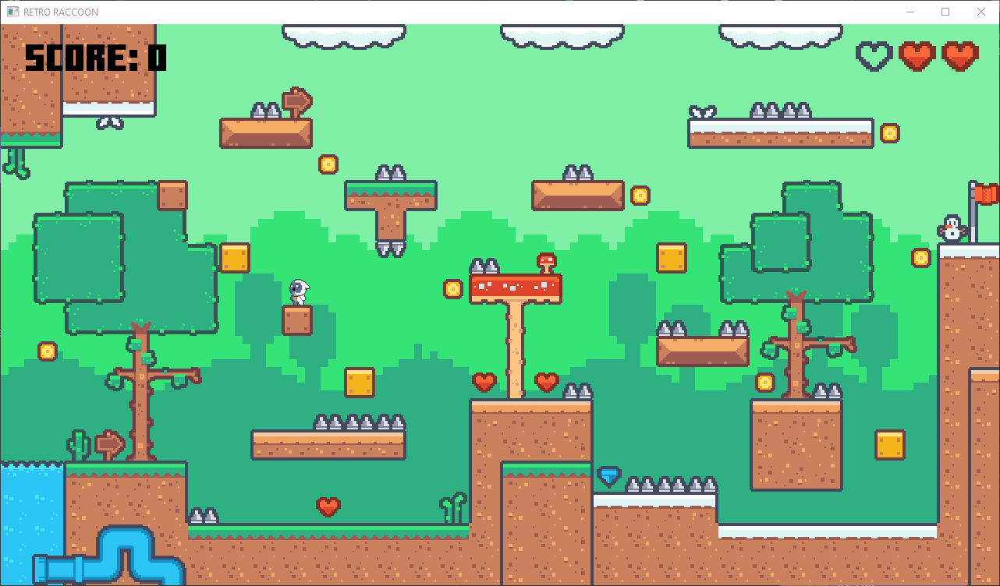
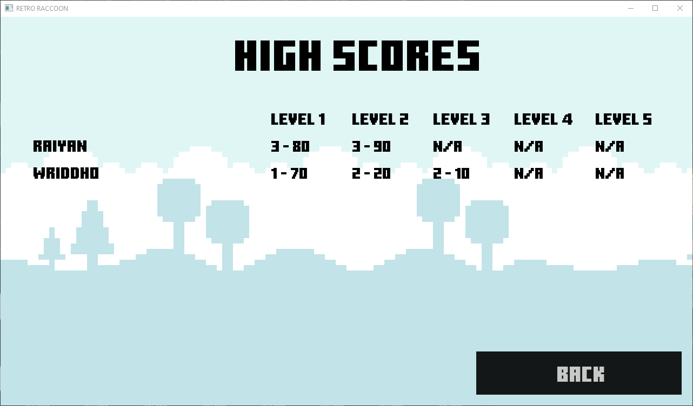

# RETRO RACCOON

A simple, fun, and customizable 2D platformer game built using [iGraphics v0.4.0](https://github.com/mahirlabibdihan/Modern-iGraphics) and C. This project was developed as the term project of the CSE 102 course of level 1, term 1 in BUET under the supervision of Sumaiya Sultana Ma'am. It demonstrates basic game functionalities, sprite animation, sound effects, saving and loading scores, and user interface design.

[Watch Demo on YouTube](https://youtu.be/akZRgeMcUow)

---

## Table of Contents

- [Project Description](#project-description)
- [Features](#features)
- [Screenshots](#screenshots)
- [Play the Game](#play-the-game)
- [Installation](#installation)
- [Gameplay](#gameplay)
- [Project Structure](#project-structure)
- [Custom Level Creation](#custom-level-creation)
- [Roadmap](#roadmap)
- [Known Issues](#known-issues)
- [Contribution Guidelines](#contribution-guidelines)
- [Credits & Acknowledgments](#credits--acknowledgments)
- [FAQ](#faq)

---

## Project Description

This project is a classic 2D platformer game where you control a character to collect coins, diamonds, and avoid obstacles. The game is designed to be easily extensible, with support for multiple levels, animated sprites, sound effects, and a simple menu system. It serves as a learning resource for beginners interested in game development with C.

---

## Features

- A menu page with options to start a new game, resume, view high scores, exit, and other navigation options
- Help page with instructions on how to play the game
- Player can pause and resume the game at any time
- Multiple levels with unique layouts and challenges
- Animated player, coin, and flag sprites
- Responsive keyboard and mouse controls
- Coin and diamond collection, and score tracking
- Lives tracking
- Simple collision detection and physics
- Option to turn on and off the sound effects and music
- High scores tracking
- Easily customizable levels

---

## Screenshots

<table>
  <tr>
    <td align="center">
      <br/>
      <b>Menu</b>
    </td>
    <td align="center">
      <br/>
      <b>Level 1</b>
    </td>
  </tr>
  <tr>
    <td align="center">
      <br/>
      <b>Level 5</b>
    </td>
    <td align="center">
      <br/>
      <b>High Scores</b>
    </td>
  </tr>
</table>

---

## Play the Game

- Download the [zip file](https://github.com/kazimdraiyan/RETRO-RACCOON/releases/download/v0.1.0/RETRO_RACCOON_v0.1.0.zip) (3.6 MB) and extract it.
- Make sure there is a folder named `saves` in the extracted directory. If not, create the folder.
- Run `RETRO_RACCOON.exe`.

> **Note:** Windows Defender may consider the game as unrecognized and therefore potentially malicious, as it is a self-compiled game. You can safely ignore the warning by clicking on `More info` and then `Run anyway`.

---

## Installation

### 1. Clone the Repository

```bash
git clone https://github.com/kazimdraiyan/RETRO-RACCOON.git
cd RETRO-RACCOON
```

Alternatively, you can download the [source code](https://github.com/kazimdraiyan/RETRO-RACCOON/archive/refs/tags/v0.1.0.zip) (99.4 MB) and extract it.

### 2. Install Dependencies

- Install [MinGW](http://www.mingw.org/).
- Ensure `g++` is in your PATH.

### 3. Build the Game

#### Windows

```bat
./runner.bat
```

#### Linux

```bash
./runner.sh
```

The game will compile and launch automatically.

---

## Gameplay

- **Menu Navigation:** Use your mouse to select options.
- **Level Selection:** Choose from the Levels Menu.
- **Gameplay:**
  - Move: `←` / `→`
  - Jump: `↑` or `Space`
  - Pause/Menu: `Esc`
  - Reach the flag on the right to win.
  - Collect coins (10 points) and diamonds (50 points) to score points.
  - Avoid traps and water.
  - Collect lives to increase your chances of survival.
- **High Scores:**
  - Go to the High Scores page from the Main Menu.
  - The high scores are saved in the `saves/high_scores.txt` file.
- **Options:**
  - Go to the Options Page from the Main Menu.
  - Turn on and off the sound effects and music.
  - The options are saved in the `saves/options.txt` file.
  - Press the Edit Name button to add a new player.
  - The current player name is saved in the `saves/current_player.txt` file.

---

## Project Structure

```md
RETRO-RACCOON/
│
├── assets/
│   ├── backgrounds/
│   ├── fonts/
│   ├── icons/
│   ├── sounds/
│   ├── special_tiles/
│   ├── sprites/
│   └── tiles/
│
├── bin/                  # Compiled executables
├── helpers/              # Helper Python scripts to encode levels
├── level_editor/         # For creating custom levels
├── levels/               # Level CSV files
├── obj/                  # Object files
├── saves/                # Saved data (player names, high scores, options)
│
├── iMain.cpp             # Main game logic
├── iGraphics.h           # iGraphics library header
├── iFont.h               # Font library header
├── iSound.h              # Sound library header
│
├── runner.bat            # Windows build & run script
├── release.bat           # Windows release build script
├── runner.sh             # Linux build & run script
│
├── .gitignore
└── README.md
```

---

## Custom Level Creation

### Prerequisites

- Download and install [Tiled](https://www.mapeditor.org).
- Install [Python](https://www.python.org/downloads/).

### Steps

- Open the `level_editor/` folder.
- Copy and paste the `level_editor/level_template.tmx` file to create a new level.
- Rename the file to `levelX.tmx`, where `X` is the level number.
  > **Note:** The level numbering starts from 1. Make sure the level numbers are consecutive.
- Open the file in Tiled.
- Create a new layer. You can create multiple layers to create a more complex level.
  > **Note:** Don't use more than 10 layers. The game might become slow otherwise.
- Draw the level by applying the tiles from the tileset on the grid.
- There are tiles of special interest:
  - Coins, diamonds, and lives - are collectable.
  - Traps and water - decreases life.
- Rename the layers to `0`, `1`, `2`, etc.
  > **Note:** The layer numbering starts from 0, where higher numbered layers are rendered on top of the lower numbered layers.
- Save the file.
- Export the level as CSV by clicking on `File` > `Export As` or pressing `Ctrl + Shift + E`.
  - Export as `levels/levelX/layer.csv`
  - After exporting, you should see files named `layer_0.csv`, `layer_1.csv`, `layer_2.csv`, etc. in the `levels/levelX/` folder.
  > **Note:** If you use only one layer, Tiled may name the file `layer.csv`. In this case, you must rename it to `layer_0.csv`.
- Now, create a new file named `metadata.txt` in the `levels/levelX/` folder.
  - The first line of the file should be the number of layers in the level.
  - The second line of the file should be the file name of the background image of the level at the `assets/backgrounds/` folder.
  
  For example, if your level has 3 layers and the background image of your level is `assets/backgrounds/background_a.png`, the metadata file should look like this:

  ```txt
  3
  background_a.png
  ```

- Now, change the `level_count` variable to the number of levels there are in the `levels/` folder, and run the `helpers/tile_encode.py` script to encode the level.
  - The script will create new files named `layer_0_customized.csv`, `layer_1_customized.csv`, `layer_2_customized.csv`, etc. in the `levels/levelX/` folder.
  - The script is used to add `isCollider` information to the tiles.

- After encoding, you can delete the original CSV files if you want.
- Now, change the `LEVEL_COUNT` macro in the `iMain.cpp` file to the number of levels there are in the `levels/` folder.
- Now, you need to add a button to open the level from the `LEVELS_PAGE` in the `iMain.cpp` file.

> To experiment with level customization, modifying existing levels is easier than creating new ones.
---

## Roadmap

- Sort the players by their high scores and display them in the High Scores Page descending order to get the leaderboard.
- Saving game state in files for being able to resume even after the game is closed.
- Add a loading screen.
- Menu nagivation using keyboard.

---

## Known Issues

- The game is not responsive to different screen sizes. It is not full-screen.
- Pressing `Ctrl` or `Shift` crashes the game.
- Resizing image blurs the image.

## Contribution Guidelines

Contributions are welcome! To contribute:

1. Fork this repository.
2. Create a new branch: `git checkout -b feature/your-feature`
3. Stage your changes: `git add .`
4. Commit your changes: `git commit -m 'Add new feature'`
5. Push to your fork: `git push origin feature/your-feature`
6. Open a [pull request](https://github.com/kazimdraiyan/RETRO-RACCOON/pulls)

Please follow standard C coding conventions and document your code.

---

## Credits & Acknowledgments

### Contributors

- [Kazi Md. Raiyan](https://github.com/kazimdraiyan/) (2405103) - me
- [Arif Awasaf Wriddho](https://github.com/WRIDDHO/) (2405102) - my teammate

### Special Thanks To

- Sumaiya Sultana for supervising, inspiring, and suggesting improvements to the project
- [Mahir Labib Dihan](https://github.com/mahirlabibdihan/) for the Modern-iGraphics library
- [Kenney](https://kenney.nl/) for the tileset [Pixel Platformer](https://kenney.nl/assets/pixel-platformer)
- [irazoki](https://freesound.org/people/irazoki/sounds/710185/) for the main menu background music
- [lovescotch](https://freesound.org/people/lovescotch/sounds/724804/) for the in-game background music

---

## FAQ

**Q: The game won't build or run. What should I do?**  
A: Ensure all dependencies are installed and try again.

**Q: Why can't the game save and load the high scores?**  
A: Make sure there is a folder named `saves` in the extracted directory. If not, create the folder.

**Q: Why my custom level is not loading?**  
A: Make sure the level is encoded correctly. After a successful encoding, you should see files named `layer_0_customized.csv`, `layer_1_customized.csv`, `layer_2_customized.csv`, etc. in the `levels/levelX/` folder. If not, check the `metadata.txt` file.

**Q: How do I use my own sprites?**  
A: Replace or add images in the `assets/sprites/` directory and update the code if needed.

**Q: How do I use my own audio files?**  
A: Replace or add audio files in the `assets/sounds/` directory and update the code if needed.

---

Don't forget to star the repository if you like it!
