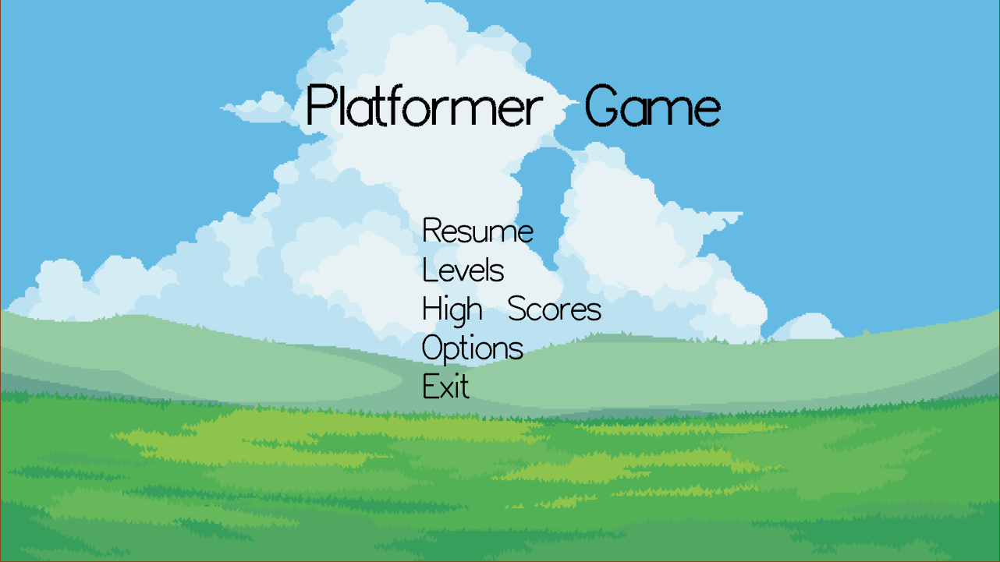
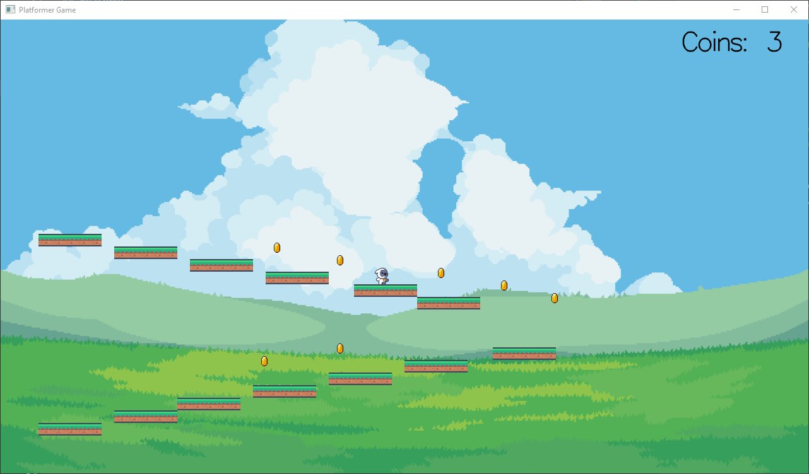

# Platformer Game with iGraphics

A simple, fun, and customizable 2D platformer game built using [iGraphics](https://github.com/mahirlabibdihan/Modern-iGraphics) and C. This project was developed as a 1-1 term project and demonstrates basic game mechanics, sprite animation, and user interface design.

---

## Table of Contents

- [Project Description](#project-description)
- [Features](#features)
- [Screenshots](#screenshots)
- [Installation](#installation)
- [Usage](#usage)
- [Configuration](#configuration)
- [Prerequisites & Dependencies](#prerequisites--dependencies)
- [Project Structure](#project-structure)
- [Contribution Guidelines](#contribution-guidelines)
- [Credits & Acknowledgments](#credits--acknowledgments)
- [Known Issues](#known-issues)
- [Roadmap](#roadmap)
- [FAQ](#faq)

---

## Project Description

This project is a classic 2D platformer game where you control a character to collect coins and avoid obstacles. The game is designed to be easily extensible, with support for multiple levels, animated sprites, and a simple menu system. It serves as a learning resource for beginners interested in game development with C, C++ and OpenGL.

---

## Features

- Multiple levels with unique layouts
- Animated player and coin sprites
- Responsive keyboard and mouse controls
- Pause, resume, and level selection menus
- Coin collection and score tracking
- Simple collision detection and physics
- Easily customizable assets and levels

---

## Screenshots




---

## Installation

### 1. Clone the Repository

```bash
git clone https://github.com/kazimdraiyan/iGraphics-Platformer-Game.git
cd platformer_game
```

### 2. Install Dependencies

#### Windows

- Install [MinGW](http://www.mingw.org/) and ensure `g++` is in your PATH.
- Download and install [SDL2](https://www.libsdl.org/download-2.0.php), [SDL2_mixer](https://www.libsdl.org/projects/SDL_mixer/), and [freeglut](http://freeglut.sourceforge.net/).
- Place the required DLLs and libraries in the appropriate folders.

### 3. Build the Game

#### Windows

```bat
./runner.bat
```

The game will compile and launch automatically.

---

## Usage

- **Menu Navigation:** Use your mouse to select options.
- **Gameplay:**
  - Move Left/Right: Arrow keys (`←` / `→`)
  - Jump: Up arrow (`↑`)
  - Pause/Menu: `Esc`
- **Level Selection:** Choose from the Levels menu.

---

## Configuration

- **Screen Size:** Change `WIDTH` and `HEIGHT` in `iMain.cpp`.
- **Levels:** Edit or add level files in `levels/levelX.txt`.
- **Assets:** Replace images in `assets/images/` and `assets/sprites/` for custom graphics.
- **Key Bindings:** Modify keyboard handling in `iMain.cpp` as needed.

---

## Prerequisites & Dependencies

- **C++ Compiler:** g++ (MinGW for Windows, GCC for Linux)
- **Libraries:**
  - [OpenGL](https://www.opengl.org/)
  - [FreeGLUT](http://freeglut.sourceforge.net/)
  - [SDL2](https://www.libsdl.org/)
  - [SDL2_mixer](https://www.libsdl.org/projects/SDL_mixer/)
- **iGraphics Library:** Included in this repository

---

## Project Structure

```md
platformer_game/
│
├── assets/
│   ├── images/         # Backgrounds, tiles, etc.
│   └── sprites/        # Player, coin, and other sprite frames
├── levels/             # Level design text files
├── bin/                # Compiled executables
├── obj/                # Object files
├── iMain.cpp           # Main game logic
├── iGraphics.h         # iGraphics library header
├── iSound.h            # Sound helper header
├── runner.sh           # Linux build & run script
├── runner.bat          # Windows build & run script
├── .gitignore
└── README.md
```

---

## Contribution Guidelines

Contributions are welcome! To contribute:

1. Fork this repository.
2. Create a new branch: `git checkout -b feature/your-feature`
3. Make your changes and commit: `git commit -am 'Add new feature'`
4. Push to your fork: `git push origin feature/your-feature`
5. Open a [pull request](https://github.com/kazimdraiyan/iGraphics-Platformer-Game/pulls)

Please follow standard C++ coding conventions and document your code.

---

## Credits & Acknowledgments

- [Mahir Labib Dihan](https://github.com/mahirlabibdihan/) for the Modern-iGraphics library
- [Arif Awasaf Wriddho](https://github.com/WRIDDHO) for additional contributions

---

## Known Issues

- Some sprite resizing may cause blurriness.
- Collision detection is basic and may not handle all edge cases.
- Game is not fully responsive to all screen sizes.

---

## Roadmap

- Add sound effects and background music
- Improve collision detection and physics
- Add more levels and enemies
- Implement high scores and options pages
- Refactor code for better modularity and OOP

---

## FAQ

**Q: How do I add a new level?**  
A: Create a new `levelX.txt` file in the `levels/` folder following the existing format.
> **Note:** Each level file must be a plain text file containing exactly 36 rows and 64 columns. Use `#` to represent solid tiles, `O` for coins, and whitespace for empty spaces.

**Q: Can I use my own sprites?**  
A: Yes! Replace or add images in the `assets/sprites/` directory and update the code if needed.

**Q: The game won't build or run. What should I do?**  
A: Ensure all dependencies are installed and your compiler is set up correctly. Check the error messages for missing libraries.

---

Enjoy playing and customizing your platformer game!
